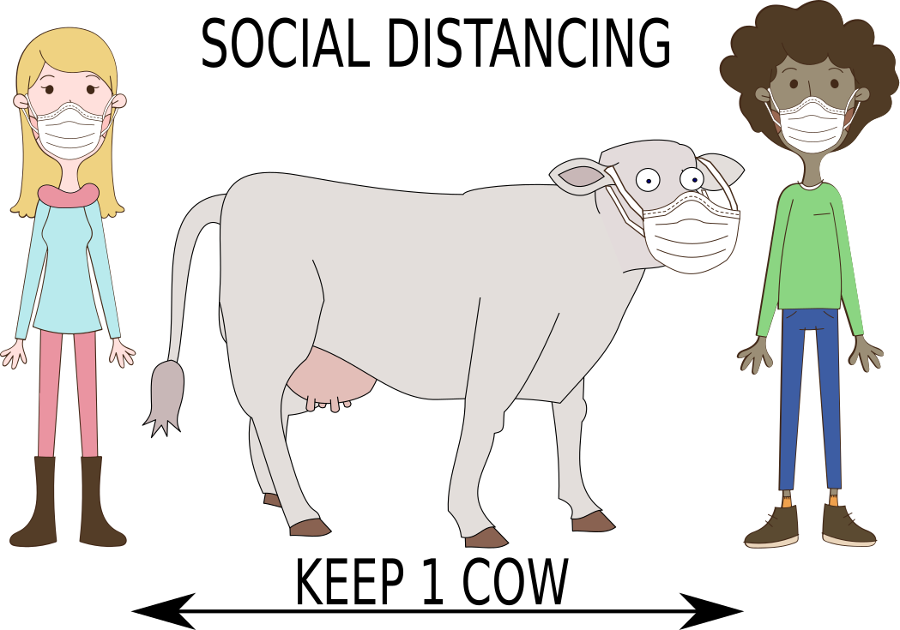

# Social Distancing Cow
Open Source version of the one-cow-distance social distancing signage

The Social Distancing Cow Graphic is a license-free open-source graphic created to remind people in a lighthearted way to maintain safe distances.

It was created from multiple open-source SVG clipart files in Inkscape using all vector-based graphics, so it is easy to edit, tweak, and rearrange the parts of the graphic.

## Sources

It was created from the following open-source clipart files, all from [Openclipart.org](https://openclipart.org/), reused under the [Creative Commons Zero 1.0 Public Domain License](http://creativecommons.org/publicdomain/zero/1.0/):

* [Cow](https://openclipart.org/detail/288025/holly-cow)
* [Man with facemask](https://openclipart.org/detail/320241/man-with-a-face-mask)
* [Woman](https://openclipart.org/detail/308239/funny-woman)
* [Facemask](https://openclipart.org/detail/319813/medical-face-mask)
